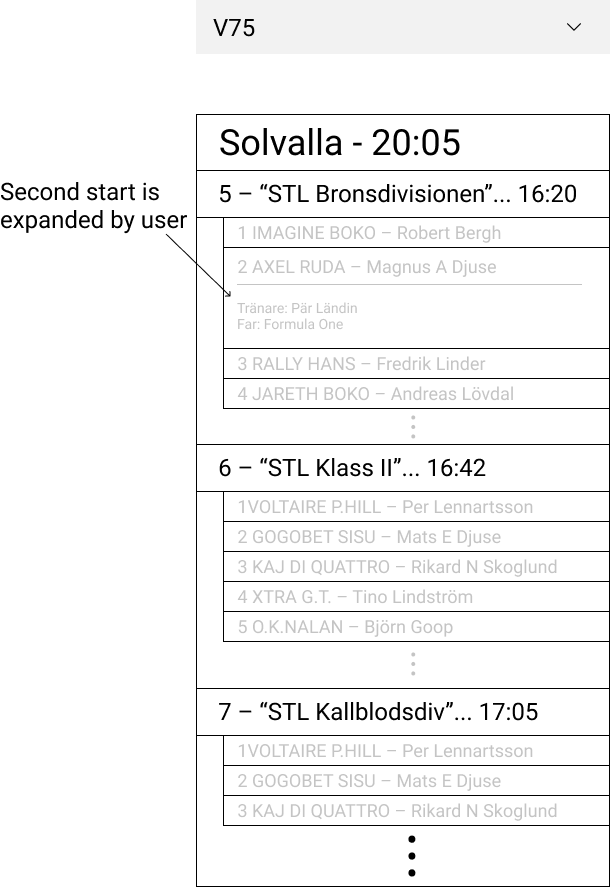

# NOTES FOR SELF
- [Atg](https://www.atg.se/) are using bootstrap so i choose to style my demo using that too.

# ATG frontend case

## Introduction

Welcome to the team! We have just received a request from our shops to visualize the horse betting results in form of a single-page web application. You have been assigned to take on the challenge and develop a solution in **React**. We expect you to send us your solution as a zipped git archive.

In short, the user should be able to **select a horse betting type** of interest and the app should show the **most recent results for that bet type**. Information about the bet type’s races and starts should also be shown. More details regarding required features are available in the [Features](#Features) section below. The plan is to put an MVP (minimum viable product) into production as soon as possible and you will make it happen! Since we are putting this application into production, make sure you leave the project in a state that you or a team member would like to find it in six months when we need to update it or add features to it. A `README.md` in the root of your project with at least instructions regarding how to run the application locally, run tests and run linting is expected.

Happy coding and good luck!

## Requirements

- Language: TypeScript (preferred) or JavaScript
- Must have: React
- Layout: See attached [wireframe](#Wireframe) for inspiration but note that your solution does not have to look like the wireframe
- Libraries: Feel free to use commonly used JavaScript libraries if it makes sense to you

## Wireframe



## Features

User should be able to:

- Select a bet type (`V75`, `V86`, `GS75`) and the most recent result for that bet type should be displayed
  - Following should be displayed: bet type, track name(s), start time
- See information about the selected bet type’s races
  - Following should be displayed: race number, race name, race start time
- See information about the starting horses in the race
  - Following should be displayed: start number, horse name, driver first and last name
- See detailed information about each horse by clicking a horse’s row
  - Following should be presented: trainer first and last name, name of the horse father

## Racing info API

### Products

**GET** https://www.atg.se/services/racinginfo/v1/api/products/{betType}

**Parameters:**
| Name | Examples |
| ------------- | -------------------- |
| betType | `V75`, `V86`, `GS75` |

### Games

**GET** https://www.atg.se/services/racinginfo/v1/api/games/{id}

**Parameters:**
| Name | Examples |
| ------------- | ------------------- |
| id | `V75_2021-02-13_6_5`|

## How to submit the solution

The solution should be submitted as a git zip archive. You create an archive by running this command:

`git archive -o ./atg-case.zip HEAD`

Then send an email to your contact at ATG with the git archive zip attached.

## Clarifications

It is allowed to use app generators like _create-react-app_, for example `npx create-react-app my-app --template typescript`. But before submitting the solution all of the configuration needs to be ejected (`npm run eject` or `yarn eject`).

******Vite stuff*********************

# React + TypeScript + Vite

This template provides a minimal setup to get React working in Vite with HMR and some ESLint rules.

Currently, two official plugins are available:

- [@vitejs/plugin-react](https://github.com/vitejs/vite-plugin-react/blob/main/packages/plugin-react/README.md) uses [Babel](https://babeljs.io/) for Fast Refresh
- [@vitejs/plugin-react-swc](https://github.com/vitejs/vite-plugin-react-swc) uses [SWC](https://swc.rs/) for Fast Refresh

## Expanding the ESLint configuration

If you are developing a production application, we recommend updating the configuration to enable type aware lint rules:

- Configure the top-level `parserOptions` property like this:

```js
export default {
  // other rules...
  parserOptions: {
    ecmaVersion: "latest",
    sourceType: "module",
    project: ["./tsconfig.json", "./tsconfig.node.json", "./tsconfig.app.json"],
    tsconfigRootDir: __dirname,
  },
};
```

- Replace `plugin:@typescript-eslint/recommended` to `plugin:@typescript-eslint/recommended-type-checked` or `plugin:@typescript-eslint/strict-type-checked`
- Optionally add `plugin:@typescript-eslint/stylistic-type-checked`
- Install [eslint-plugin-react](https://github.com/jsx-eslint/eslint-plugin-react) and add `plugin:react/recommended` & `plugin:react/jsx-runtime` to the `extends` list
